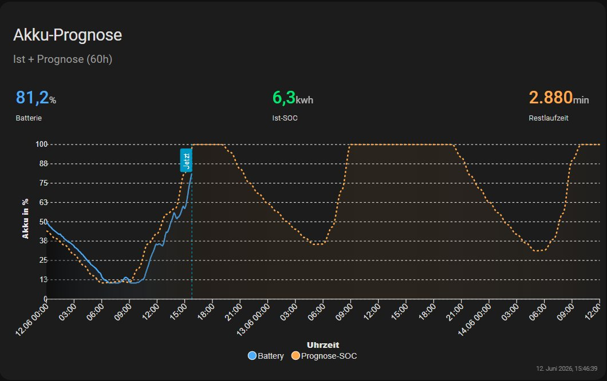
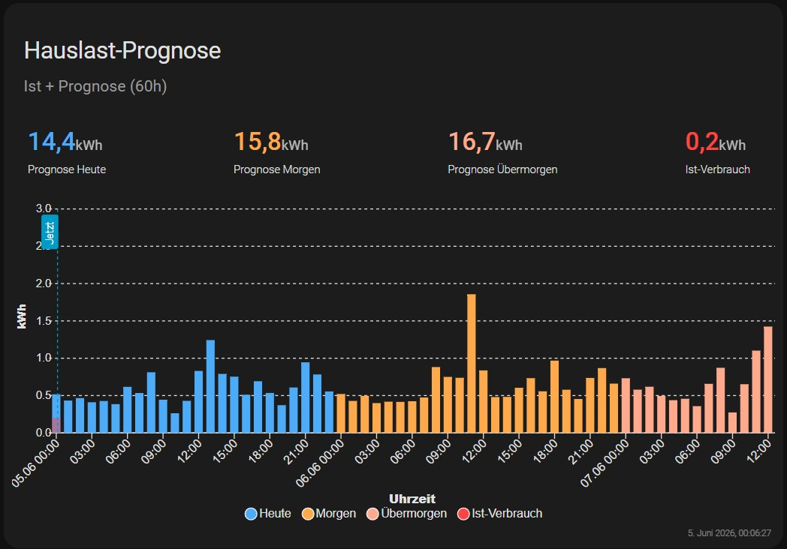

# Hauslast Prognose & Akku Restlaufzeit

[](https://github.com/hacs/integration)
[](https://github.com/thokoh74-DE/houseload_forecast/releases)
[]()
[](LICENSE)

🌍 **Deutsch** | [English](README.en.md)

Eine Home Assistant Custom Integration zur **stündlichen Hauslast-Prognose** und **Akku-Restlaufzeit-Berechnung** für PV-Anlagen mit Batteriespeicher. Die Prognose basiert auf den tatsächlichen historischen Verbrauchsdaten aus der Home Assistant Statistik-Datenbank – unterschieden nach jedem einzelnen Wochentag.

---

## Funktionsübersicht

- **Hauslast-Prognose (Heute & Morgen):** Stündliche Prognose des Haushaltsverbrauchs in kWh, aufgebaut aus den historischen Verbrauchsdaten der letzten *n* Wochen
- **7 individuelle Tagesprofile:** Jeder Wochentag (Montag bis Sonntag) bekommt ein eigenes 24-Stunden-Profil – kein pauschales Wochentag/Wochenende mehr
- **IQR-Ausreißerfilter:** Messartefakte und Zählerresets werden automatisch herausgefiltert
- **Konfigurierbarer Datenzeitraum:** Von 1 Woche bis unbegrenzt (0 = gesamte Datenbasis)
- **Fallback-Profile:** Manuelle Stundenprofile für Werktage und Wochenenden, solange noch nicht genug Datenpunkte vorhanden sind (< 10 Tage)
- **Akku-Restlaufzeit:** Stundengenaue SOC-Prognose kombiniert PV-Vorhersage (Solcast), Hauslast-Prognose und aktuellen Akkustand
- **Restore nach Neustart:** Der letzte bekannte Restlaufzeit-Wert bleibt nach einem HA-Neustart erhalten, bis neue valide Sensorwerte vorliegen

---

## Voraussetzungen

| Anforderung | Details |
|---|---|
| Home Assistant | ≥ 2024.1 (empfohlen: ≥ 2026.3 für Icon-Unterstützung) |
| Batteriespeicher-Integration | AlphaESS oder vergleichbar – muss Kapazität (kWh) und SoC (%) als Sensoren liefern |
| PV-Prognose | [Solcast Solar Forecast](https://github.com/BJReplay/ha-solcast-solar) mit `detailedHourly`-Attribut |
| Hauslast-Sensor | Sensor mit `state_class: total_increasing` (kWh, stündlich) oder `measurement` (W) – muss in der HA-Statistik erfasst sein |
| SQLite-Datenbank | Standard-HA-Datenbank unter `/config/home-assistant_v2.db` |

---

## Installation

### Über HACS (empfohlen)

1. HACS in Home Assistant öffnen
2. **Integrationen** → Drei-Punkte-Menü oben rechts → **Benutzerdefinierte Repositories**
3. URL eingeben: `https://github.com/thokoh74-DE/houseload_forecast`
4. Kategorie: **Integration** → **Hinzufügen**
5. Die Integration **„Hauslast Prognose & Akku Restlaufzeit"** erscheint nun in der HACS-Liste
6. **Herunterladen** klicken → Home Assistant neu starten

### Manuell

1. Den Ordner `custom_components/houseload_forecast/` aus dem [neuesten Release](https://github.com/thokoh74-DE/houseload_forecast/releases) herunterladen
2. In `config/custom_components/houseload_forecast/` kopieren
3. Home Assistant neu starten

---

## Einrichtung

1. **Einstellungen → Geräte & Dienste → Integration hinzufügen**
2. Nach **„Hauslast Prognose"** suchen
3. **Schritt 1 – Sensoren konfigurieren:**

| Feld | Beschreibung |
|---|---|
| Effektive Akkukapazität | Sensor, der die nutzbare Akkukapazität in kWh liefert |
| Akku-Ladestand (SoC) | Sensor für den aktuellen Ladezustand in % |
| Entladeschluss / Reserve | Sensor für den minimalen SoC in % (z.B. `10` für 10 % Reserve) |
| PV-Prognose Heute | Solcast-Sensor mit `detailedHourly`-Attribut für heute |
| PV-Prognose Morgen | Solcast-Sensor mit `detailedHourly`-Attribut für morgen |
| Force Export Active | Optional: `input_boolean` für Force-Export-Modus |
| Force-Export Leistung | Optional: `number`-Entität mit der Export-Leistung in kW |
| Hauslast stündlich | Stündlicher Verbrauchssensor, der in der HA-Statistik erfasst ist |
| Datenzeitraum | Anzahl Wochen für die historische Berechnung (0 = alles) |

4. **Schritt 2 – Fallback-Profile:** Manuelle Stundenprofile in Watt für Werktage (Mo–Fr) und Wochenende (Sa+So) – werden automatisch durch historische Daten ersetzt, sobald ≥ 10 Datentage vorhanden sind

---

## Einstellungen anpassen

Über **Einstellungen → Geräte & Dienste → Hauslast Prognose → Konfigurieren** erscheint ein Menü:

- **Sensoren anpassen** – Sensoren und Datenzeitraum ändern (ohne die Fallback-Profile zu verlieren)
- **Fallback-Profile bearbeiten** – Stundenwerte anpassen (ohne die Sensor-Konfiguration zu verlieren)

---

## Erzeugte Sensoren

### Hauptsensoren

| Sensor | Einheit | Beschreibung |
|---|---|---|
| `sensor.house_load_forecast_today` | kWh | Tagesprognose Hauslast für heute (House Load Forecast Today) |
| `sensor.house_load_forecast_tomorrow` | kWh | Tagesprognose Hauslast für morgen (House Load Forecast Tomorrow) |
| `sensor.pv_battery_runtime_forecast` | min | Verbleibende Zeit bis zum Entladeschluss (PV Battery Runtime Forecast). Ein Wert von **2880 min bedeutet, dass der Akku innerhalb der nächsten 48 Stunden laut Prognose nicht leer wird.** |

### Wichtige Attribute

**`sensor.house_load_forecast_today` (House Load Forecast Today) / `sensor.house_load_forecast_tomorrow` (House Load Forecast Tomorrow):**

```yaml
forecast:
  - period_start: "2026-05-24T00:00:00+02:00"
    load_estimate: 0.43       # kWh für diese Stunde
  - period_start: "2026-05-24T01:00:00+02:00"
    load_estimate: 0.42
  # ... 24 Einträge gesamt
profile_montag: [435, 420, ...]   # 24 Watt-Werte
profile_dienstag: [...]
# ... alle 7 Tagesprofile
wochentag: "Samstag"
profil_quelle_heute: "Historisch (letzte 8 Wochen, state (kWh→W), IQR-gefiltert)"
daten_basis: "Historisch (letzte 8 Wochen)"
data_days: 56
```

**`sensor.pv_battery_runtime_forecast` (PV Battery Runtime Forecast):**

```yaml
soc_hourly_forecast:
  - period_start: "2026-05-24T16:00:00+02:00"
    soc_kwh: 7.8
  - period_start: "2026-05-24T17:00:00+02:00"
    soc_kwh: 7.2
  # ... bis zu 48 Einträge
bat_kwh: 7.8
bat_max_kwh: 7.78
diag_soc_pct: 100.0
diag_cutoff_pct: 10.0
```

### Diagnose-Sensoren

Alle Diagnose-Sensoren erscheinen auf der Gerätseite unter **„Diagnose"** und sind standardmäßig ausgeblendet:

| Sensor | Beschreibung |
|---|---|
| Last Forecast Update | Zeitstempel der letzten Berechnung |
| Data History Days | Wie viele Tage historische Daten vorhanden sind |
| Battery State of Charge | Aktueller SoC in % |
| Effective Battery Capacity | Akkukapazität in kWh |
| Usable Capacity | Aktuell nutzbare Energie in kWh |
| Remaining Capacity to Cutoff | Verbleibende Energie bis Entladeschluss |
| Force Export Active | Status des Force-Export-Modus |

---

## Profilberechnung im Detail

```
Datenlage                      Verhalten
─────────────────────────────────────────────────────────
< 10 Tage Daten                → Manuelles Fallback-Profil
≥ 10 Tage, MEASUREMENT-Sensor → AVG(mean) je Stunde & Wochentag
≥ 10 Tage, TOTAL_INC-Sensor   → AVG(state × 1000) je Stunde & Wochentag
Ausreißer                      → IQR-Filter (Faktor 3) vor Mittelwertbildung
Stunde mit < Datenpunkten      → Fallback-Wert für diese Stunde
```

Der **IQR-Ausreißerfilter** entfernt Werte außerhalb von `[Q1 − 3×IQR, Q3 + 3×IQR]` pro Stunde und Wochentag, bevor der Mittelwert berechnet wird. So werden Messartefakte durch HA-Neustarts oder Zählerreset-Ereignisse nicht in das Profil übernommen.

---

## Dashboard-Beispiele

### Akku-Prognose (ApexCharts)

Zeigt den aktuellen Batterieladezustand (blau) und die SOC-Prognose der nächsten 48 Stunden (orange gestrichelt).



<details>
<summary>YAML anzeigen</summary>

```yaml
type: custom:apexcharts-card
graph_span: 48h
header:
  show: true
  show_states: true
  colorize_states: true
  standard_format: true
cache: true
show:
  loading: false
  last_updated: true
now:
  show: true
  label: Jetzt
span:
  start: day
all_series_config:
  show:
    header_color_threshold: true
    legend_value: false
series:
  - entity: sensor.alphaess_soc_battery
    name: Battery
    transform: return x;
    yaxis_id: battery
    type: area
    color: "#4dabf7"
    extend_to: now
    curve: smooth
    fill_raw: last
    opacity: 0.6
    stroke_width: 2
    float_precision: 1
    group_by:
      func: avg
      duration: 5min
    show:
      legend_value: false
      in_header: false
  - entity: sensor.battery_state_of_charge
    show:
      in_header: true
      in_chart: false
    name: Batterie
    float_precision: 1
    color: "#4dabf7"
  - entity: sensor.pv_battery_runtime_forecast
    name: Prognose-SOC
    unit: kWh
    yaxis_id: power
    color: "#ffa94d"
    stroke_width: 2
    stroke_dash: 3
    float_precision: 2
    type: area
    opacity: 0.3
    data_generator: |
      const forecast = entity.attributes.soc_hourly_forecast || [];
      const dayStart = new Date();
      dayStart.setHours(0, 0, 0, 0);
      return forecast
        .map(entry => [
          new Date(entry.period_start).getTime(),
          entry.soc_kwh
        ])
        .filter(point => point[0] >= dayStart.getTime());
    show:
      legend_value: false
      in_header: false
      in_chart: true
    extend_to: false
  - entity: sensor.usable_capacity
    name: Ist-SOC
    unit: kWh
    color: "#00e676"
    show:
      in_header: true
      in_chart: false
    float_precision: 1
  - entity: sensor.pv_battery_runtime_forecast
    name: Restlaufzeit
    unit: min
    yaxis_id: power
    color: "#ffa94d"
    stroke_width: 2
    stroke_dash: 3
    float_precision: 1
    type: area
    opacity: 0.3
    show:
      legend_value: false
      in_header: true
      in_chart: false
    extend_to: false
apex_config:
  chart:
    height: 350px
    stacked: false
  dataLabels:
    enabled: false
  grid:
    padding:
      left: 0
      right: 0
  xaxis:
    title:
      text: Uhrzeit
    type: datetime
    labels:
      datetimeFormatter:
        hour: HH:mm
        day: dd.MM
  tooltip:
    x:
      format: dd.MM.yy HH:mm
  fill:
    type: gradient
    gradient:
      shadeIntensity: 1
      opacityFrom: 0.5
      opacityTo: 0.1
      stops:
        - 0
        - 100
yaxis:
  - id: power
    min: 0
    max: 7.78
    decimals: 0
    apex_config:
      title:
        text: Restkapazität (kWh)
      tickAmount: 8
  - id: battery
    min: 0
    max: 100
    decimals: 0
    opposite: true
    apex_config:
      tickAmount: 8
      title:
        text: Akku in %
      labels:
        formatter: |
          EVAL:function(value) {
            return value.toFixed(0);
          }
grid_options:
  columns: full
card_mod:
  style: |
    ha-card {
      box-shadow: none;
      border: none;
    }
```

> **Hinweis:** `sensor.alphaess_soc_battery`, `sensor.battery_state_of_charge` und `sensor.usable_capacity` müssen ggf. an deine eigenen Sensor-Namen angepasst werden. Den `max`-Wert der Y-Achse (`7.78`) auf deine Akkukapazität anpassen.

</details>

---

### Hauslast-Prognose (ApexCharts)

Zeigt die stündliche Prognose für heute (blau) und morgen (orange) als Balkendiagramm, zusammen mit dem tatsächlichen Ist-Verbrauch (rot).



<details>
<summary>YAML anzeigen</summary>

```yaml
type: custom:apexcharts-card
graph_span: 48h
header:
  show: true
  show_states: true
  colorize_states: true
cache: true
show:
  loading: true
  last_updated: true
all_series_config:
  show:
    header_color_threshold: true
    legend_value: false
apex_config:
  chart:
    height: 350px
    stacked: true
  plotOptions:
    bar:
      columnWidth: 70%
  dataLabels:
    enabled: false
  grid:
    padding:
      left: 0
      right: 0
  xaxis:
    title:
      text: Uhrzeit
    labels:
      show: true
      tickPlacement: between
  yaxis:
    title:
      text: kWh
    min: 0
    max: 3
    stepSize: 0.5
    decimalsInFloat: 1
span:
  start: day
now:
  show: true
  label: Jetzt
series:
  - entity: sensor.house_load_forecast_today
    name: Heute
    type: column
    color: "#4dabf7"
    unit: kWh
    show:
      in_header: false
      legend_value: false
    data_generator: >
      const forecast = entity.attributes.forecast || [];
      return forecast.slice(1).map(item => [
        new Date(item.period_start).getTime(),
        item.load_estimate
      ]);
  - entity: sensor.house_load_forecast_today
    name: Prognose Heute
    float_precision: 1
    color: "#4dabf7"
    unit: kWh
    show:
      in_chart: false
      in_header: true
  - entity: sensor.house_load_forecast_tomorrow
    name: Morgen
    type: column
    color: "#ffa94d"
    unit: kWh
    show:
      in_header: false
      legend_value: false
    data_generator: >
      const forecast = entity.attributes.forecast || [];
      return forecast.map(item => [
        new Date(item.period_start).getTime(),
        item.load_estimate
      ]);
  - entity: sensor.house_load_forecast_tomorrow
    name: Prognose Morgen
    color: "#ffa94d"
    unit: kWh
    float_precision: 1
    show:
      in_chart: false
      in_header: true
  - entity: sensor.hauslast_taglich
    name: Ist-Verbrauch
    color: "#ff4444"
    unit: kWh
    float_precision: 1
    show:
      in_chart: false
      in_header: true
  - entity: sensor.hauslast_stundlich
    name: Ist-Verbrauch
    type: column
    color: "#ff4444"
    opacity: 0.5
    unit: kWh
    show:
      legend_value: false
      in_header: false
    group_by:
      func: last
      duration: 1h
    extend_to: now
grid_options:
  columns: full
card_mod:
  style: |
    ha-card {
      box-shadow: none;
      border: none;
    }
```

> **Hinweis:** `sensor.hauslast_taglich` und `sensor.hauslast_stundlich` müssen ggf. an deine eigenen Sensor-Namen angepasst werden. Den `max`-Wert der Y-Achse (`3`) ggf. an deinen typischen Verbrauch anpassen.

</details>

---

## Fehlerbehebung

### Prognose-Werte erscheinen als 0 oder Fallback

Prüfe im Debug-Log (Einstellungen → System → Protokolle), ob Meldungen wie `"Fallback (nur X Tage Daten)"` erscheinen. Das Attribut `data_days` am Sensor zeigt, wie viele Tage Daten vorhanden sind – es werden mindestens 10 benötigt.

### Ausreißer bei bestimmten Stunden

Das Skript `debug_hauslast.py` kann direkt auf dem HA-Host ausgeführt werden und zeigt die Rohwerte je Stunde aus der Statistik-Datenbank:

```bash
python3 /config/debug_hauslast.py
```

### Icon wird nicht angezeigt

Erfordert Home Assistant ≥ 2026.3. Bei älteren Versionen bleibt das Integrations-Icon leer.

### Sensor nach Neustart kurz auf altem Wert

Das ist beabsichtigt – der letzte Wert wird per `RestoreEntity` wiederhergestellt, bis die abhängigen Sensoren (Batterie, PV) wieder verfügbar sind.

---

## Changelog

Den vollständigen Changelog mit allen Versionen findest du in der [CHANGELOG.md](CHANGELOG.md).

### v1.1.0
- Sensor-Namen und Entity-IDs auf Englisch umgestellt
- Zweisprachige Einstellungen (Deutsch/Englisch)
- Zwei README-Dateien (Deutsch + Englisch)

### v1.0.0
- Erstveröffentlichung auf HACS

---

## Lizenz

MIT License – siehe [LICENSE](LICENSE)

---

## Danksagung

- [Solcast Solar Forecast](https://github.com/BJReplay/ha-solcast-solar) für die PV-Vorhersage
- [ApexCharts Card](https://github.com/RomRider/apexcharts-card) für die Dashboard-Visualisierung
- [homeassistant-alphaESS](https://github.com/CharlesGillanders/homeassistant-alphaESS) von CharlesGillanders für die AlphaESS-Integration
- [Integrating AlphaESS Inverter into Home Assistant via Modbus](https://projects.hillviewlodge.ie/alphaess/) von Projects@Hillview
